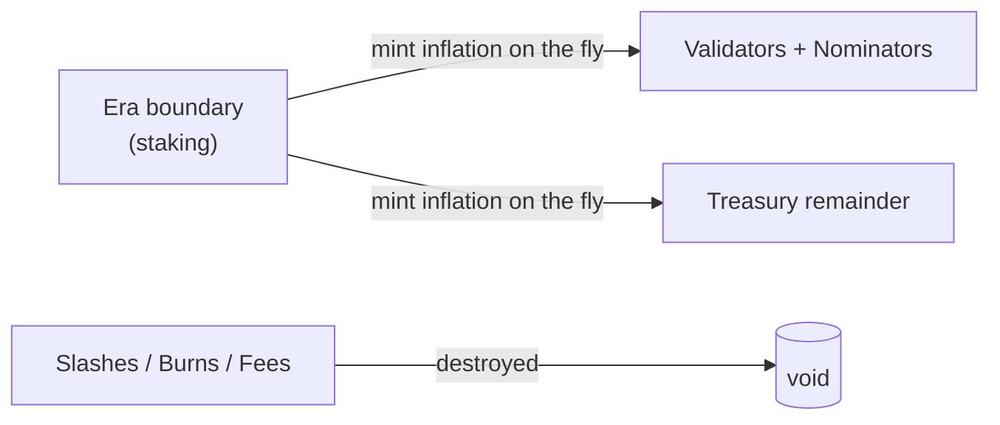
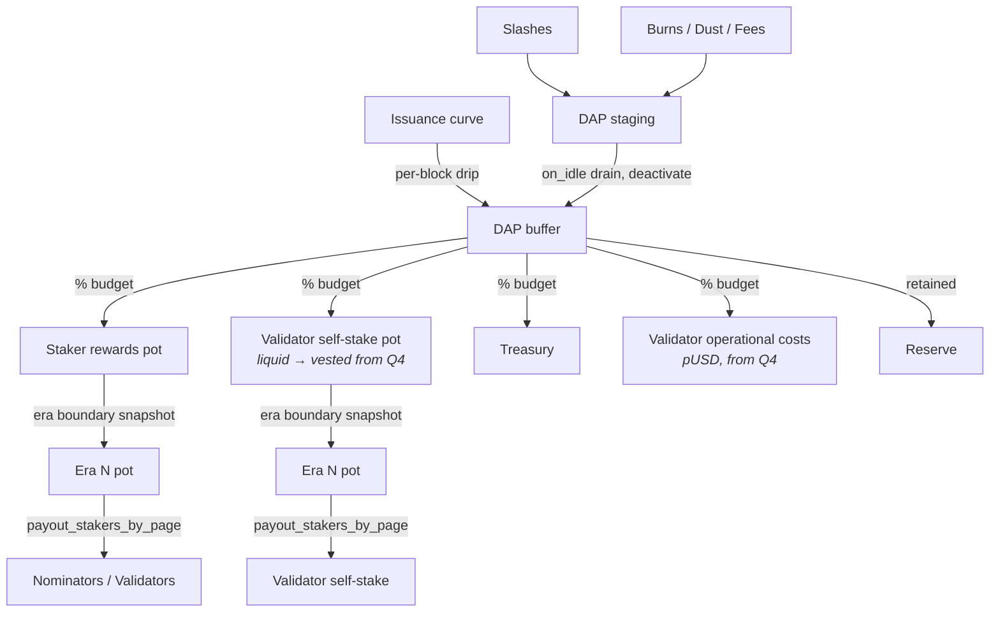
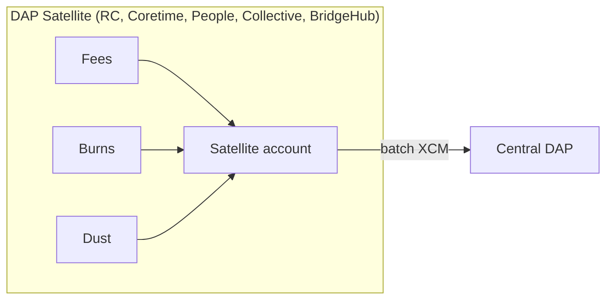

<!-- end_slide -->

## Why change staking at all?

- **Cost outruns value captured.** Issuance funds a ~10%-per-year security premium. Transaction fees captured: near zero. No closed loop — ~50% of rewards leave the DOT economy each era (taxes, fiat conversion).
- **Security tracks price, and price has slipped.** Cost-of-attack scales with DOT price and now it is 1–2 orders of magnitude below its peak. A reward system that weakens the token weakens its own security base.
- **Nominators don't do the job the economic model assumes.** Majority of stake, majority of rewards — but no observable curation signal.
- **Shared-security demand < funded supply.** Active rollups / coretime consumption doesn't back the security capacity we pay for.
- Conclusion: staking was designed for an economy that captures value. We didn't build that economy. The reward system is eating its own security base.

<!-- end_slide -->

## Goals

- Secure the validator set at **lower cost**.
- Separate **infra cost** (fiat) from **skin-in-the-game** (DOT).
- Give governance a dial for how issuance is split.
- Prepare the ground for **Proof of Personhood** to replace pure Proof of Stake.

We are not killing staking. We are paying less for the same security, while re-purposing the savings.

<!-- end_slide -->

## How

- cap + halving defends price
- DAP closes the loop: slashes / burns / fees return to the protocol instead of being destroyed
- pUSD breaks the sell-to-pay-fiat flow
- POSS (Proof of Social Stake) replaces stake-as-signal with personhood.

<!--
speaker_note: |
For POSS: instead of inferring validator trustworthiness from how much money is pointed at them, infer it from how
many verified unique humans endorse them. Each person gets a weight cap, so the signal is "N independent
humans vouch for validator X" rather than "N DOT are bonded behind X". Cheaper (no perpetual inflation needed to pay
signal-producers), sybil-resistant in a different way, and harder to buy. Or so we hope :-)
-->

<!-- end_slide -->

## Timeline at a glance

| When                                     | What                                                                                                    |
| ---------------------------------------- | ------------------------------------------------------------------------------------------------------- |
| **14 Mar 2026**                          | Ref 1710 — new issuance curve enacted (cap 2.1B, halving every 2y)                                      |
| **Feb 2026 — release 2.1.0**             | DAP collecting slashes & burns, StakingOperator proxy, session keys on AH, treasury burns stopped       |
| **End of May 2026**                      | Minimum self-stake of 10k DOT enforced on validators                                                    |
| **End of May 2026**                      | Nominators become fast-unbondable and unslashable                                                       |
| **~Jun 2026 — release 2.3.0 / SDK 2604** | DAP becomes the minter; self-stake incentive code live                                                  |
| **Mid June 2026**                        | Referendum to enable self-stake budget                                                                  |
| **Q3 2026**                              | Start of POSS-staking design (new election mechanism replacing NPoS)                                    |
| **Q4 2026**                              | Staking vs pUSD integration and introduction of payment for validators operational costs in stablecoins |

<!-- end_slide -->

## Issuance curve, cap, halving

- Ref 1710 (enacted 14 Mar 2026) caps total supply at **2.1B DOT**.
- **Halving every 2 years** until the cap.
- **What is NOT fixed**: how the new issuance is split between staking, treasury, reserve.

<!-- end_slide -->

## Before DAP: staking mints its own rewards

- Staking **owned** the issuance curve.
- Rewards minted at payout time.
- Slashes and burns simply disappeared. No visibility of what was being destroyed.
- The protocol had no savings account and no place to re-allocate budget changes. Any budget change required editing staking-internal parameters.

<!-- end_slide -->

## The DAP — Dynamic Allocation Pool

- **One pallet owns issuance.**
- **Mints every block** ("continuous drip"): each block the issuance curve produces a per-block _budget_ of new DOT into the DAP buffer. No fresh minting at era boundaries — eras just snapshot accumulated pots for payout.
- **One budget/outflow per destination**, each with a governance-tunable % of the budget: staker rewards, validator self-stake, treasury, reserve (coming next: validator operational costs in pUSD).
- Slashes / burns / dust / fees flow IN, not to `/dev/null`.
- Goverance can retune the % split
- Staking pallet only moves funds between DAP-owned pots at era boundaries

<!-- end_slide -->

## Architecture after DAP

<!--
speaker_note: |
  Three things to highlight: (1) the drip is continuous, (2) staking only moves funds between DAP-owned pots at era boundaries — no fresh minting inside staking, (3) the staging account deactivates incoming funds so they do not inflate active issuance.
-->

<!-- end_slide -->

## What changed in staking-async

- **No minting at payout time.** `payout_stakers` used to call `deposit_creating` (create fresh DOT on the fly). Now it's just a transfer from the era pot to the staker.
- Two general pots are watched: **StakerRewards** and **ValidatorSelfStake**.
- At era end, staking **snapshots** current pot balances into era-specific pots.
- Payouts draw from era pots. Zero minting.
- Self-stake rewards use a new **piecewise sqrt curve**.

<!-- speaker_note: From staking's point of view, the rewards are just a balance sitting in a known account. `payout_stakers` becomes a `transfer`, not a mint. This also makes budgets observable on-chain (balance of pot accounts). -->

<!-- end_slide -->

## Self-stake incentive

- **Hard floor**: 10k DOT minimum self-stake per validator (from end of May 2026). With nominators unslashable and fast-unbondable, validators carry the real security weight — a per-validator floor is the backstop.
- **On top of the floor**: a separate reward stream for self-stake. Piecewise curve: `sqrt(s)` up to an optimum `T`, then gently up to a cap `C`, then flat.
- Encourages a more uniform distribution of self-stake above the floor.

<!-- end_slide -->

## Validator pay will split into three streams

| Stream               | Currency | Purpose                                         | Liquidity          |
| -------------------- | -------- | ----------------------------------------------- | ------------------ |
| Staker rewards pot   | **DOT**  | commission + own exposure share (existing flow) | liquid             |
| Self-stake incentive | **DOT**  | skin-in-the-game via piecewise-sqrt curve       | liquid → vested Q4 |
| Operational payment  | **pUSD** | operational costs                               | liquid             |

Today only the first stream exists (pre-DAP). Self-stake incentive lands in 2.3.0 (~Jun 2026); operational payment in Q4.

- Reduces structural DOT sell pressure: fiat costs are paid in pUSD, not DOT.
- Self-stake incentive vests from Q4 → aligns validators long-term.

**Open — DAP ↔ pUSD integration**: direction approved in principle. pUSD-acquisition mechanics are a **parallel track**, not a blocker.

- How does the DAP acquire pUSD to pay validators? (staked-DOT → vault → pUSD)
- What `CR` (collateralization ratio) targets are safe across DOT-price extremes?
- Permissionless mechanisms to "heal" the DAP vault if DOT drops.

<!-- end_slide -->

## DAP is more than a mint

DAP is also the protocol's **revenue sink**:

- Slashes → DAP.
- Transaction / tip burns → DAP.
- Dust removal → DAP.
- Treasury burns → DAP (treasury no longer destroys DOT).

Funds flowing in are **deactivated** in the buffer, shrinking active issuance.

<!-- end_slide -->

## DAP Satellite

Relay chain and all system chain expected AssetHub hosts a pallet accumulating and forwarding to the central DAP over XCM.

- Collects local fees / burns / revenue.
- Batches and forwards to central DAP over XCM.
- Today DAP-specific. Soon to be reworked into a **generic accumulate-and-forward pallet** — reusable for anything XCM-teleported in batches.

<!-- speaker_note: Generic pallet will likely ship after 2.3.0. It is a natural building block; right now the logic is tightly coupled to DAP. -->

<!-- end_slide -->

## Code organization

- **`pallet-dap`** — owner of issuance, pots, drip, budget split, slash/burn sink.
- **`pallet-dap-satellite`** — local sink + XCM forwarder (soon to be replaced by a generic accumulate and forward pallet).
- **`pallet-staking-async`** — no longer mints; reads pot balances; runs era snapshots; applies self-stake curve.

<!-- end_slide -->

## (Tentative) Future: Proof of Social Stake (POSS)

- **POSS = Proof of Social Stake**, the personhood-based layer.
- Security should not forever pay a perpetual inflation tax. Personhood helps.
- Voters move from pseudonymous (on-chain identify via account) stake to **PoP-verified** voters with a stake cap.
- Reward multiplier `m` for PoP voters. System transitions fluidly — zero PoP today → mostly PoP later, no hard switch.
- Target start: **Q3 2026**. One-year horizon. Implies a **complete staking rewrite**.

<!-- end_slide -->

## Future: new election mechanism

- NPoS (sequential Phragmén) will be replaced.
- New approach: **randomized committee election** with prescribed probabilities.
- Each candidate has a target election probability proportional to weighted votes.
- Strong concentration bounds → a minority faction cannot over-grab committee seats.

<!-- end_slide -->

## Other notable changes impacting staking

- **Smaller validator set** — gradual reduction (e.g. 600 → 300), paired with core disables so per-validator workload stays flat. Depends on RFC17 (new coretime market redesign).
- Support for **Basti blocks**

<!-- end_slide -->

## Q&A

<!-- end_slide -->
